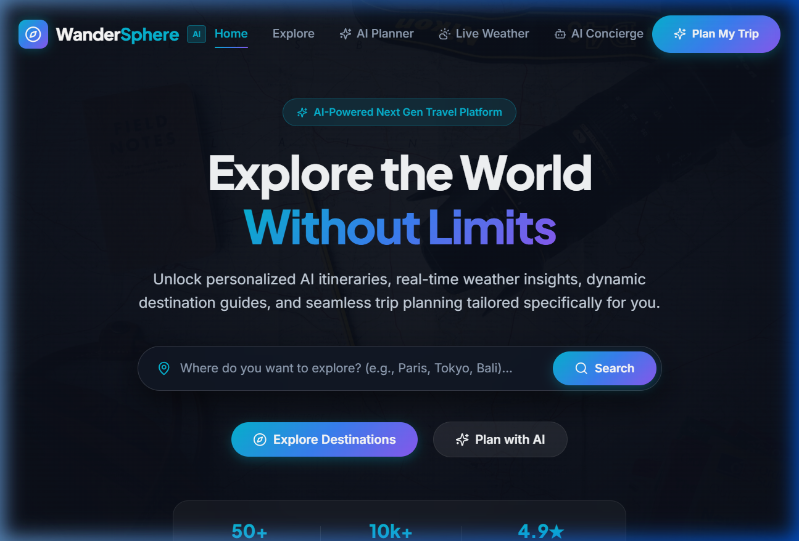
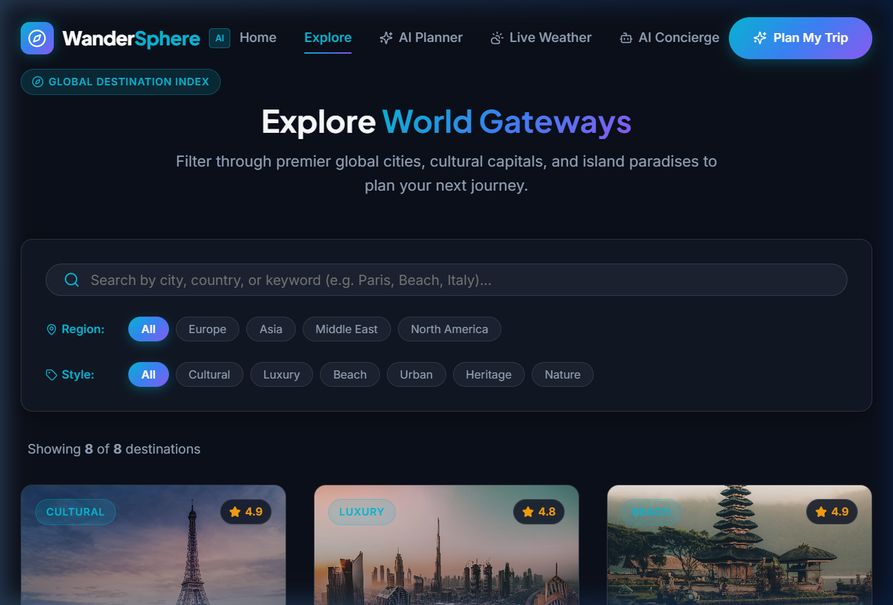
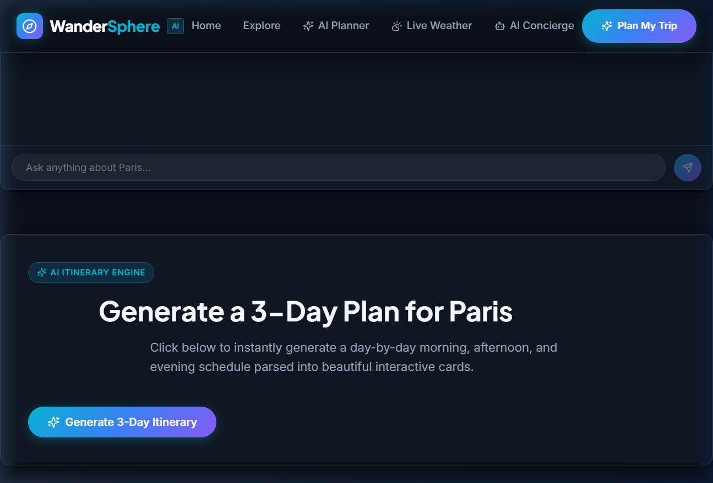
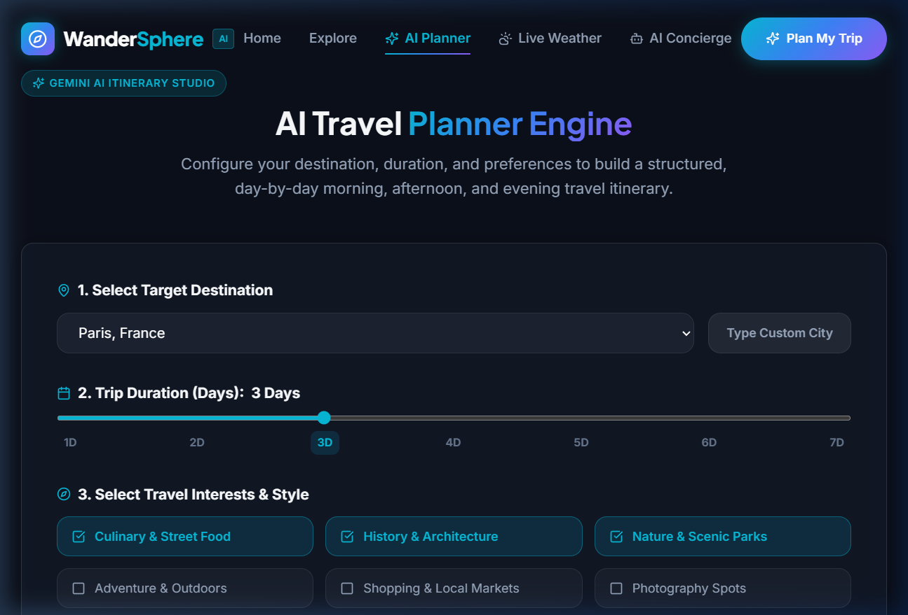
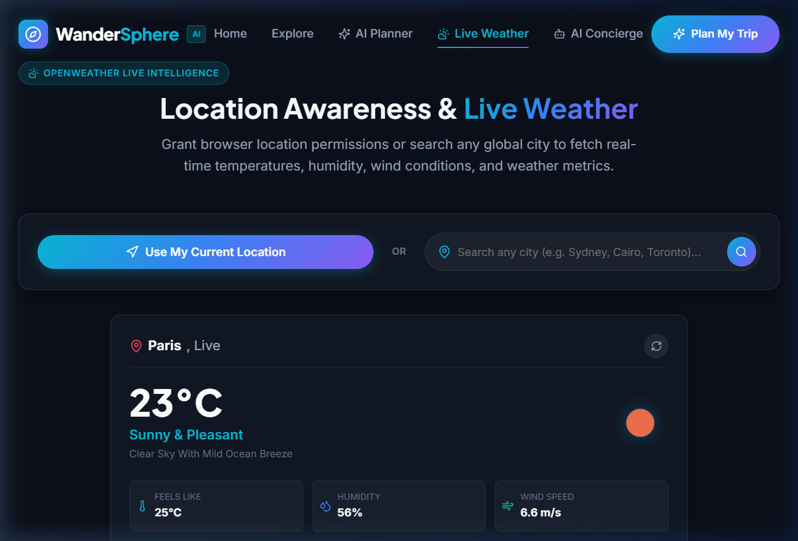

# 🌐 WanderSphere – AI Travel Planner & Global Explorer

> **Front-End Developer Assessment Project**  
> A complete, professional, luxury-themed Front-End Travel Web Application built with **React.js**, **Vite**, **React Router DOM**, **Google Gemini AI**, **OpenWeather API**, **Unsplash API**, and **Browser Geolocation**.

---

## 📸 Application Screenshots

### 1. Luxury Landing Page & Hero Section


### 2. Destination Explorer & Real-Time Search (`/explore`)


### 3. Destination Details & Famous Landmark Attractions (`/destination/paris`)


### 4. AI Structured Itinerary Planner (`/planner`)


### 5. Location Awareness & Live Weather Hub (`/weather`)


---

## 🌟 Project Overview

**WanderSphere** is a next-generation web application designed to empower travelers worldwide. It provides interactive destination discovery, real-time atmospheric weather metrics, location-aware positioning, dynamic photography, an intelligent travel chatbot, and structured day-by-day itinerary planning powered by Google Gemini AI.

---

## 🚀 Key Features

### 1. 🏙️ Luxury Landing Page
* **Hero Experience:** Full-screen looping travel video background with high-contrast dark overlay gradient.
* **Catchy Headline:** *"Explore the World Without Limits"* with modern gradient typography.
* **Quick Search:** Instant destination search directly from the hero bar.
* **Metrics Showcase:** Interactive statistics (50+ Cities, 10k+ Itineraries, 4.9★ Rating).
* **Smooth Navigation:** Glassmorphic fixed navbar with mobile drawer menu and smooth scroll indicators.

### 2. 🗺️ Destination Explorer (`/explore`)
* **Comprehensive Grid:** Interactive destination cards for world-famous cities (**Paris**, **Dubai**, **Bali**, **Tokyo**, **London**, **Rome**, **New York**, **Bengaluru**, and more).
* **Real-time Search Filter:** Instant client-side search filtering by city name, country, or description keywords.
* **Region & Style Chips:** Filter by regions (*Europe*, *Asia*, *Middle East*, *North America*) and travel styles (*Cultural*, *Luxury*, *Beach*, *Urban*, *Heritage*, *Nature*).

### 3. 📍 Destination Details Page (`/destination/:id`)
* **Dynamic Hero Banner:** High-resolution dynamic photography with country and rating badges.
* **Overview Metrics:** Quick glance cards for *Best Time to Visit*, *Recommended Stay*, *Local Currency*, and *Official Language*.
* **Live Weather Integration:** Live temperature and weather widget pre-loaded for the target destination.
* **Famous Tourist Places:** Card grid featuring top landmark attractions with category tags and location details (e.g. *Eiffel Tower*, *Louvre Museum*, *Arc de Triomphe* for Paris; *Burj Khalifa*, *Palm Jumeirah* for Dubai).
* **Context-Aware AI Assistant:** Embedded Google Gemini travel chatbot pre-prompted specifically for the selected city.
* **One-Click 3-Day Itinerary Engine:** Generate an instant 3-day itinerary directly on the destination view.

### 4. 🏛️ Famous Landmark Attractions
* Every destination features professional cards showcasing top famous places with dynamic photos, category badges (*Architectural Marvel*, *Sacred Temple*, *Royal Heritage*, etc.), descriptions, and location pins.

### 5. 📍 Location Awareness & Geolocation (`/weather`)
* **"Use My Current Location":** One-click browser Geolocation (`navigator.geolocation`) permission request.
* **Coordinates Display:** Displays exact detected latitude and longitude.
* **Manual Location Search:** Dedicated city input bar to check live weather for any global location.
* **Error Handling:** Graceful fallback states for permission denied, timeout, or location unavailable.

### 6. ☀️ Live Weather Hub (OpenWeather API)
* Displays current **Temperature (°C)**, **Weather Condition**, **Icon**, **Humidity (%)**, **Wind Speed (m/s)**, and **Feels-Like Temperature**.
* Shimmer loading skeletons and error state management.

### 7. 📸 Dynamic Image Service (Unsplash API)
* Dynamically fetches high-resolution travel and landmark imagery using Unsplash photo search API based on search queries.
* Includes curated high-definition fallback imagery to ensure the UI never breaks.

### 8. 🤖 AI Travel Chatbot (Google Gemini API)
* Powered by Google Gemini (`@google/generative-ai`).
* Answers questions regarding travel duration, food recommendations, weather seasons, and budget tips.
* Includes suggested prompt chips for instant answers, user/bot chat bubble UI, typing indicators, and fallback responses.

### 9. 🗓️ AI Structured Itinerary Planner (`/planner`)
* **Input Controls:** Destination picker, Trip Duration slider (1 to 7 Days), and Travel Interest checkboxes (*Culinary*, *History*, *Nature*, *Adventure*, *Shopping*, *Photography*, *Nightlife*).
* **Structured Output:** **Do not display as raw text block**. Parsed and rendered as clean daily cards broken down into **Morning**, **Afternoon**, and **Evening** activities with time badges and descriptions.
* **Copy & Export:** One-click "Copy Itinerary to Clipboard" feature.

---

## 🛠️ Technology Stack & APIs

| Layer | Technology |
| :--- | :--- |
| **Core Framework** | React 18, Vite |
| **Routing** | React Router DOM v6 |
| **Icons & Design** | Lucide React, Custom CSS Glassmorphism Design System |
| **Fonts** | Plus Jakarta Sans, Inter (Google Fonts) |
| **Weather API** | OpenWeather API |
| **AI Engine** | Google Gemini API (`@google/generative-ai`) |
| **Image API** | Unsplash API |
| **Browser API** | HTML5 Geolocation API |

---

## 📁 Project Structure

```text
c:\Travel
├── public/
│   └── screenshots/
│       ├── homepage_hero.png
│       ├── explore_page.png
│       ├── destination_details.png
│       ├── itinerary_planner.png
│       └── live_weather.png
├── src/
│   ├── components/
│   │   ├── ChatbotWidget.jsx & .css
│   │   ├── DestinationCard.jsx & .css
│   │   ├── FamousPlaceCard.jsx & .css
│   │   ├── Footer.jsx & .css
│   │   ├── Hero.jsx & .css
│   │   ├── ItineraryCard.jsx & .css
│   │   ├── LoadingSkeleton.jsx & .css
│   │   ├── LocationSelector.jsx & .css
│   │   ├── Navbar.jsx & .css
│   │   ├── ScrollToTop.jsx
│   │   └── WeatherWidget.jsx & .css
│   ├── data/
│   │   └── destinationsData.js
│   ├── pages/
│   │   ├── ChatPage.jsx & .css
│   │   ├── DestinationDetails.jsx & .css
│   │   ├── Explore.jsx & .css
│   │   ├── Home.jsx & .css
│   │   ├── NotFound.jsx
│   │   ├── Planner.jsx & .css
│   │   └── WeatherPage.jsx & .css
│   ├── services/
│   │   ├── geminiService.js
│   │   ├── unsplashService.js
│   │   └── weatherService.js
│   ├── App.jsx
│   ├── index.css
│   └── main.jsx
├── .env.example
├── .gitignore
├── index.html
├── package.json
├── README.md
├── vercel.json
└── vite.config.js
```

---

## 🔑 Environment Variables Setup

Create a `.env` file in the project root directory (copied from `.env.example`):

```bash
VITE_OPENWEATHER_API_KEY=your_openweather_api_key_here
VITE_GEMINI_API_KEY=your_gemini_api_key_here
VITE_UNSPLASH_ACCESS_KEY=your_unsplash_access_key_here
```

> **Note**: The application features built-in fallback data for all three services so the UI operates seamlessly out-of-the-box even before API keys are added.

---

## 💻 Installation & Running Locally

1. **Clone or Navigate to Project Directory:**
   ```bash
   cd c:\Travel
   ```

2. **Install Dependencies:**
   ```bash
   npm install
   ```

3. **Start Development Server:**
   ```bash
   npm run dev
   ```
   Open your browser at `http://localhost:3000`.

4. **Build for Production:**
   ```bash
   npm run build
   ```

---

## 📄 License & Credits
Crafted for Front-End Developer Project Assessment.  
Built with ❤️ using React.js and Vite.
